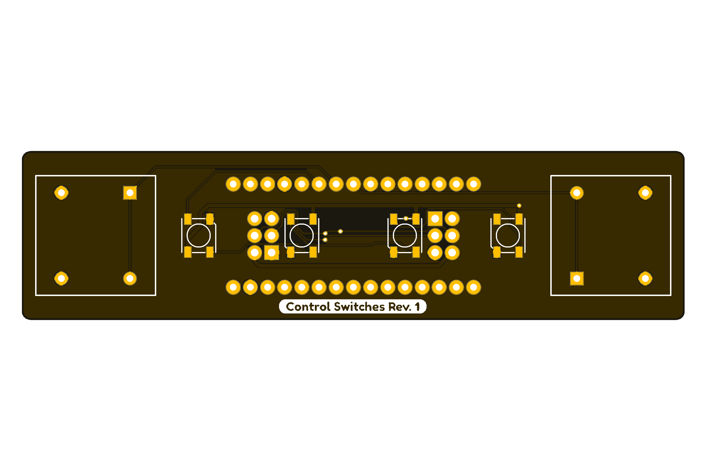

<h1 align="center">
    Printed Circuit Boards for SUSTAINA-OP2&trade;
</h1>

    <table>
        <tr>
            <td align="center">Constant Voltage Board</td>
            <td align="center">PMX Control Board</td>
            <td align="center">Power Distribution Board</td>
        </tr>
        <tr>
            <td align="center"></td>
            <td align="center"></td>
            <td align="center"></td>
        </tr>
        <tr>
            <td align="center">Power Logging Board</td>
            <td align="center">Power Monitor Module</td>
            <td align="center">SBC Power Board</td>
        </tr>
        <tr>
            <td align="center"></td>
            <td align="center"></td>
            <td align="center"></td>
        </tr>
        <tr>
            <td align="center">Strain Gauge Sensing Board</td>
            <td align="center">USB to Quad RS-485 Conv. Module</td>
            <td align="center">Power Supply Switching Board</td>
        </tr>
        <tr>
            <td align="center"></td>
            <td align="center"></td>
            <td align="center"></td>
        </tr>
        <tr>
            <td align="center">SCI Extension Board</td>
            <td align="center">Control Switches Board</td>
            <td align="center"></td>
        </tr>
        <tr>
            <td align="center"></td>
            <td align="center"></td>
            <td align="center"></td>
        </tr>
    </table>

> [!NOTE]
> This repository provides design and order data for PCBs of [SUSTAINA-OP2&trade;](https://github.com/SUSTAINA-OP/SUSTAINA-OP2).

## Features of SUSTAINA-OP2&trade;'s PCBs

All SUSTAINA-OP PCBs are compatible with PCBA (Print Curcuit Board Assembly) in order to reduce the production barriers (e.g. selection and mounting of electronic components) before they are mounted on the robot (except for missing and some components).

The PCB fabrication and PCBA used for all SUSTAINA-OP2 are outsourced to JLCPCB.

> [!WARNING]
> Some components to be mounted on the PCB (e.g. not in stock or not handled)  cannot be mounted using PCBA and must be mounted by yourself.

> [!CAUTION]
> JLCPCB is not a sponsor of SUSTAINA-OP.

## Repository Contents

SUSTAINA-OP2&trade; PCBs can be divided into two main categories.  
The first is Module, which is a single package of sensors, conversion circuits, etc. in functional units, and can be easily replaced.  
The second is the Board, which is a multi-functional PCB that contains modules and other components.

### Boards

### Modules

## Development Environment
The PCBs for SUSTAINA-OP2 were designed in **Autodesk Eagle 9.6.2**.

## License Information
This product is open source. Please review the [LICENSE(EN)](/LICENSE) / [LICENSE(JA)](/LICENSE-JA) for license information.

This product by Masato Kubotera is licensed under a [CC BY-NC-SA 4.0 DEED](http://creativecommons.org/licenses/by-nc-sa/4.0/).

> [!NOTE]
> **Summary:**
> - **Attribution** — You must give appropriate credit , provide a link to the license, and indicate if changes were made.
> - **NonCommercial** — You may not use the material for commercial purposes.
> - **ShareAlike** — If you remix, transform, or build upon the material, you must distribute your contributions under the same license as the original.

> [!TIP]
> - **Examples of appropriate credit** — [SUSTAINA-OP2&trade;](https://github.com/SUSTAINA-OP/SUSTAINA-OP) &copy; Masato Kubotera (2024) CC BY-NC-SA 4.0 DEED
> >
> - **Reference & Citation**  
>   To reference and/or cite the work contained in this repository, please use the following publications:
>   - Kubotera, M. and Hayashibara, Y.: SUSTAINA-OP&trade;: Kid-sized Open Hardware Platform Humanoid Robot with Emphasis on Sustainability. RoboCup 2023: Robot World Cup XXVI, pp.166–178 (2024) [Springer](https://link.springer.com/chapter/10.1007/978-3-031-55015-7_14)

## Contact
If you have any questions, please contact the designer of this product, Masato Kubodera, by [E-mail](masatokubotera06@yahoo.co.jp).
