<h1 align="center">
    Printed Circuit Boards for SUSTAINA-OP2&trade;
</h1>
<table align="center">
    <tr>
        <td align="center"><a href="./SUSTAINA-Constant-Voltage-Board">Constant Voltage Board</a></td>
        <td align="center"><a href="./SUTAINA-Control-Switches-Board">Control Switches Board</a></td>
        <td align="center"><a href="./SUSTAINA-PMX-Control-Board">PMX Control Board</a></td>
    </tr>
    <tr>
        <td align="center">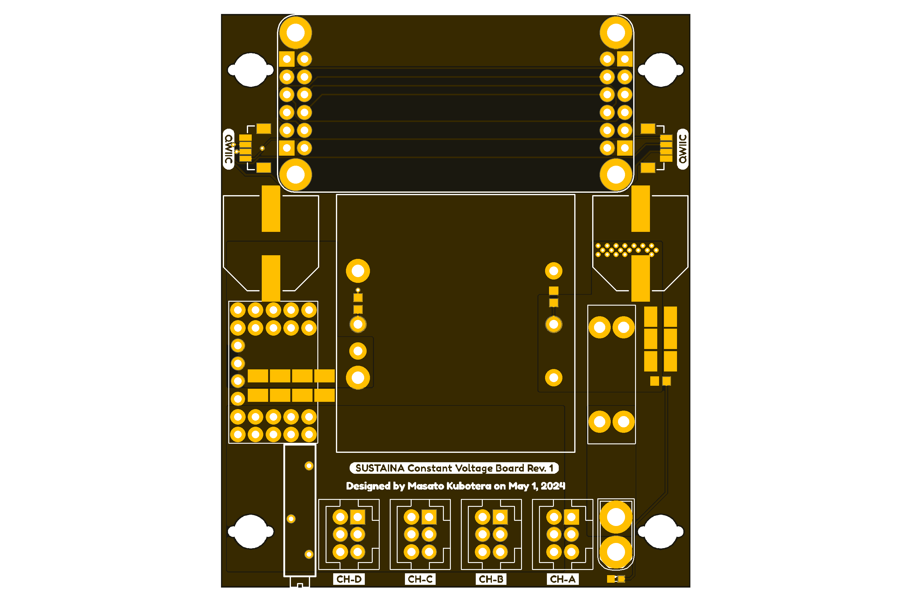</td>
        <td align="center">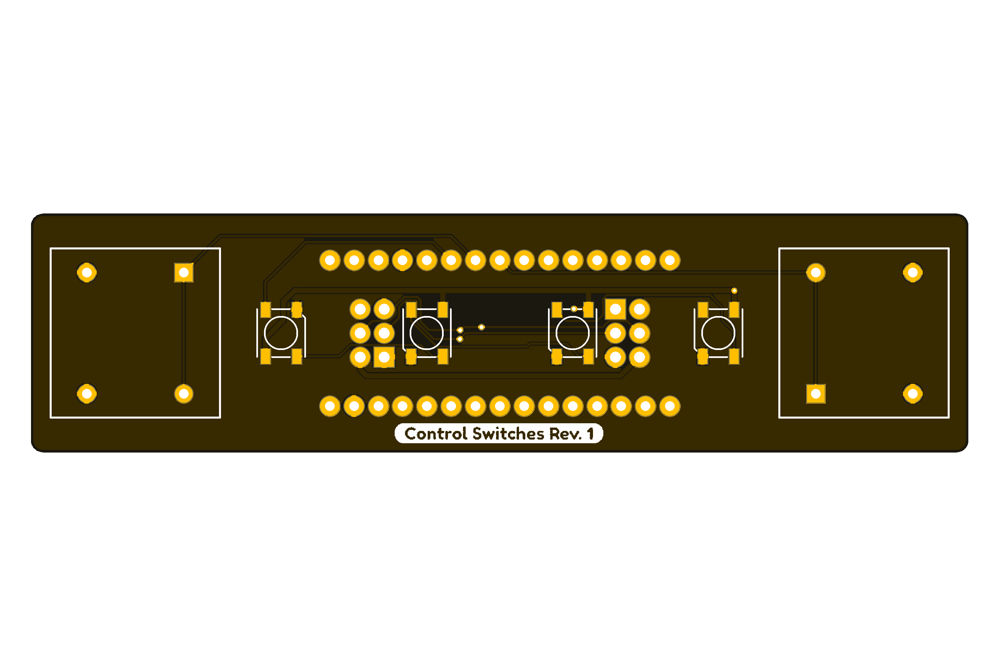</td>
        <td align="center">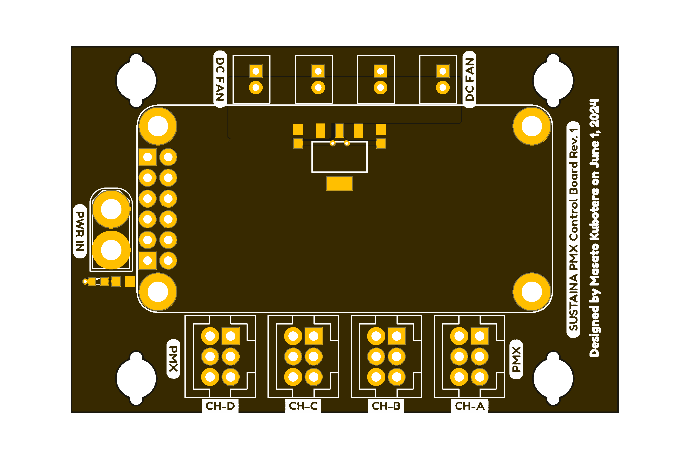</td>
    </tr>
    <tr>
        <td align="center"><a href="./SUSTAINA-Power-Logging-Board">Power Logging Board</a></td>
        <td align="center"><a href="./SUSTAINA-Power-Distribution-Board">Power Distribution Board</a></td>
        <td align="center"><a href="./SUSTAINA-Power-Supply-Switching-Board">Power Supply Switching Board</a></td>
    </tr>
    <tr>
        <td align="center">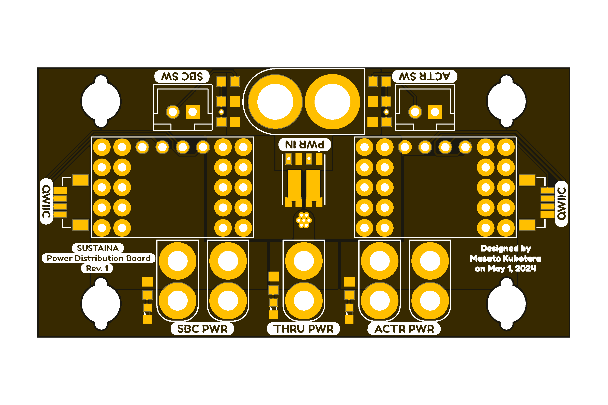</td>
        <td align="center">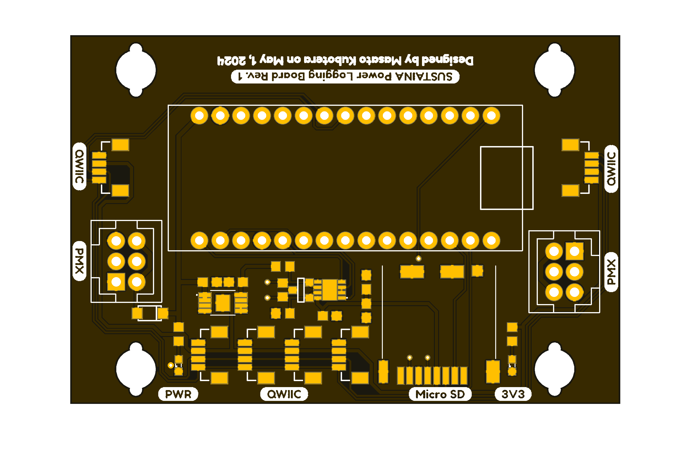</td>
        <td align="center">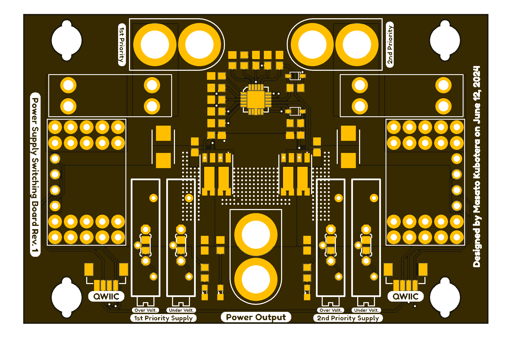</td>
    </tr>
    <tr>
        <td align="center"><a href="./SUSTAINA-SBC-Power-Board">SBC Power Board</a></td>
        <td align="center"><a href="./SUSTAINA-SCI-Extension-Board">SCI Extension Board</a></td>
        <td align="center"><a href="./SUSTAINA-StrainGauge-Sensing-Board">Strain Gauge Sensing Board</a></td>
    </tr>
    <tr>
        <td align="center">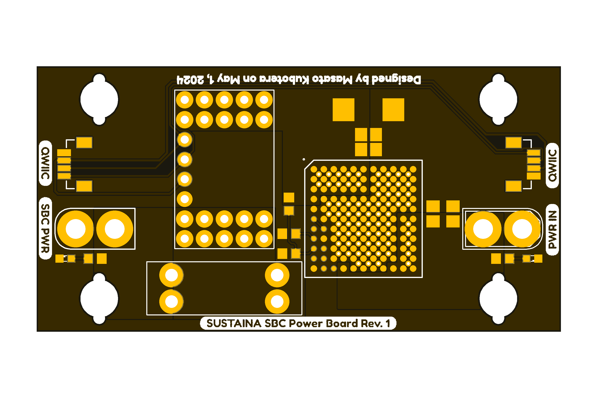</td>
        <td align="center">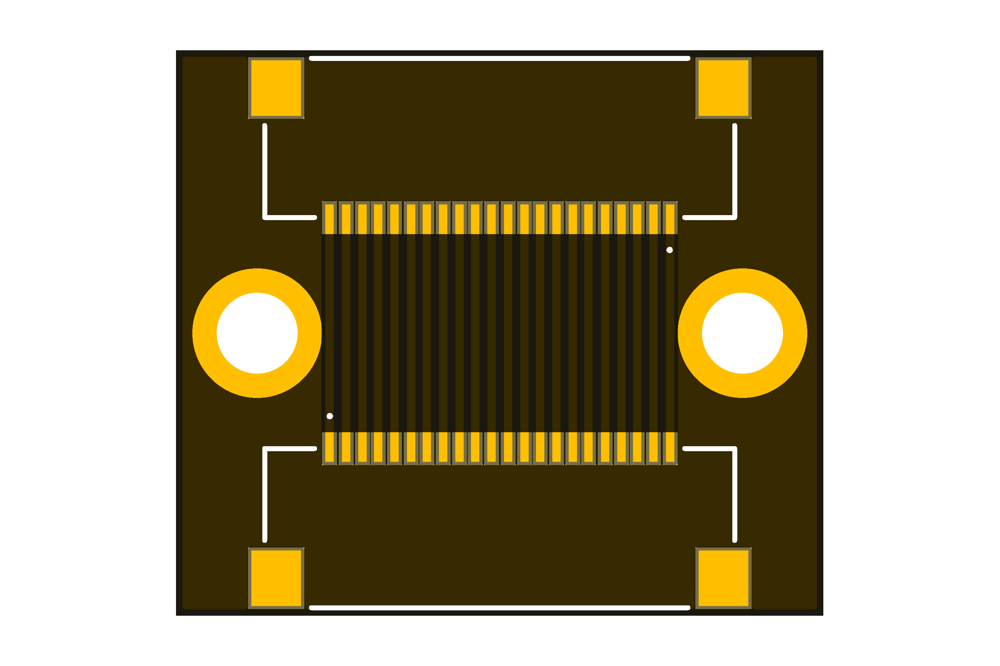</td>
        <td align="center">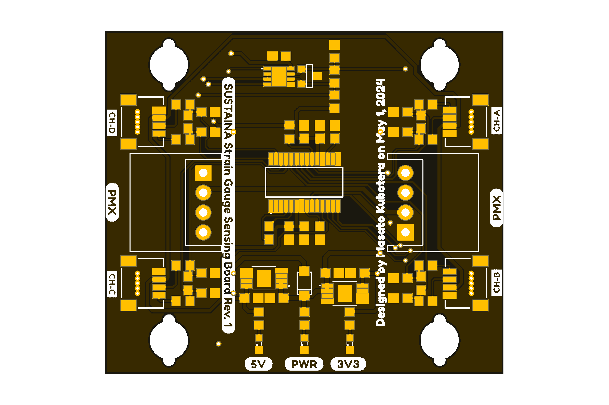</td>
    </tr>
    <tr>
        <td align="center"><a href="./SUSTAINA-Power-Monitor-Module">Power Monitor Module</a></td>
        <td align="center"><a href="./SUSTAINA-USB-to-Quad-RS-485-Conv-Module">USB to Quad RS-485 Conv. Module</a></td>
        <td align="center"></td>
    </tr>
    <tr>
        <td align="center">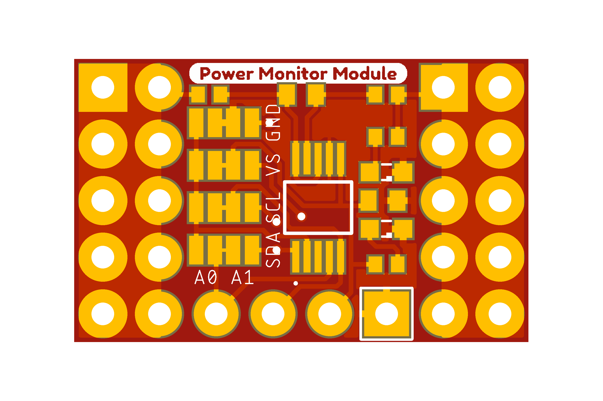</td>
        <td align="center">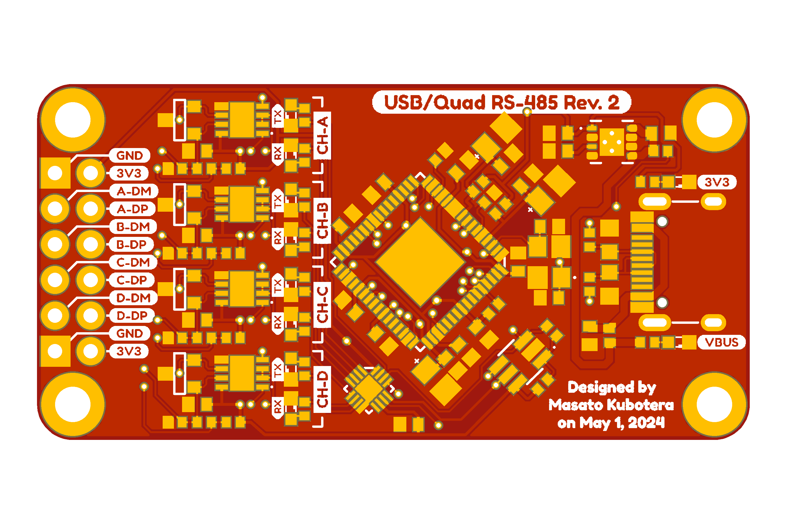</td>
        <td align="center"></td>
    </tr>
</table>

> [!NOTE]
> This repository provides design and order data for PCBs of SUSTAINA-OP2&trade;. 
> Other SUSTAINA-OP2&trade; contents
> - Mechanical: https://github.com/SUSTAINA-OP/SUSTAINA-OP2
> - Firmware: https://github.com/SUSTAINA-OP/SUSTAINA-OP2-Firmware

## Features of SUSTAINA-OP2&trade;'s PCBs

All PCBs for SUSTAINA-OP are compatible with PCBA, which can reduce production barriers (such as selecting and assembling electronic components) before they are assembled into robots.

The PCB fabrication and PCBA used for all SUSTAINA-OP2 are outsourced to JLCPCB!

> [!WARNING]
> Some components to be assembled on the PCB (e.g. not in stock or not handled)  cannot be assembled using PCBA and must be assembled by yourself.

## Repository Contents

The PCBs of SUSTAINA-OP2&trade; can be divided into two main categories. 
The first is "module," which packages sensors, conversion circuits, etc. in functional units on a single board and can be easily replaced. 
The second is "board", which is a multifunctional PCB with modules and other components.

### Boards
- [Constant Voltage Board](./SUSTAINA-Constant-Voltage-Board)
- [Control Switches Board](./SUTAINA-Control-Switches-Board)
- [PMX Control Board](./SUSTAINA-PMX-Control-Board)
- [Power Logging Board](./SUSTAINA-Power-Logging-Board)
- [Power Distribution Board](./SUSTAINA-Power-Distribution-Board)
- [Power Supply Switching Board](./SUSTAINA-Power-Supply-Switching-Board)
- [SBC Power Board](./SUSTAINA-SBC-Power-Board)
- [SCI Extension Board](./SUSTAINA-SCI-Extension-Board)
- [StrainGauge Sensing Board](./SUSTAINA-StrainGauge-Sensing-Board)

### Modules
- [Power Monitor Module](./SUSTAINA-Power-Monitor-Module)
- [USB to Quad RS-485 Conv. Module](./SUSTAINA-USB-to-Quad-RS-485-Conv-Module)

## Development Environment
The PCBs for SUSTAINA-OP2&trade; were designed in **Autodesk Eagle 9.6.2**.

## License Information
This product is open source. Please review the [LICENSE(EN)](/LICENSE) / [LICENSE(JA)](/LICENSE-JA) for license information.

This product by Masato Kubotera is licensed under a [CC BY-NC-SA 4.0 DEED](http://creativecommons.org/licenses/by-nc-sa/4.0/).

> [!NOTE]
> **Summary:**
> - **Attribution** — You must give appropriate credit , provide a link to the license, and indicate if changes were made.
> - **NonCommercial** — You may not use the material for commercial purposes.
> - **ShareAlike** — If you remix, transform, or build upon the material, you must distribute your contributions under the same license as the original.

> [!TIP]
> - **Examples of appropriate credit** — [SUSTAINA-OP2&trade;](https://github.com/SUSTAINA-OP/SUSTAINA-OP) &copy; Masato Kubotera (2024) CC BY-NC-SA 4.0 DEED
> >
> - **Reference & Citation**  
>   To reference and/or cite the work contained in this repository, please use the following publications:
>   - Kubotera, M. and Hayashibara, Y.: SUSTAINA-OP&trade;: Kid-sized Open Hardware Platform Humanoid Robot with Emphasis on Sustainability. RoboCup 2023: Robot World Cup XXVI, pp.166–178 (2024) [Springer](https://link.springer.com/chapter/10.1007/978-3-031-55015-7_14)
>
>     **The paper is about SUSTAINA-OP&trade;. Publications on SUSTAINA-OP2&trade; will be published soon.**

## Contact
If you have any questions, please contact the designer of this product, Masato Kubodera, by [E-mail](masatokubotera06@yahoo.co.jp).
